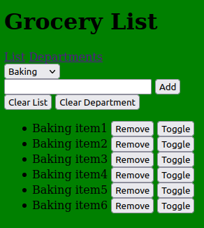
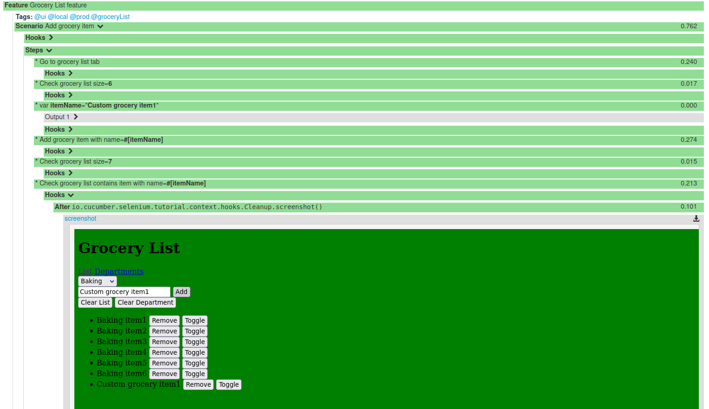

# Cucumber Selenium tutorial
How to test a website using Cucumber and Selenium

## Dependencies used
- [**selenium-jutils**](https://github.com/fslev/selenium-jutils)
- [**cucumber-jutils**](https://github.com/fslev/cucumber-utils)
- Selenium and Cucumber for java
- Lombok

## How to run
Start Selenium Grid via _docker-compose_ from _src/test/resources/selenium_:  
```
docker-compose -f selenium-grid.yml up
```
Run tests with Maven:  
```
mvn clean verify -Plocal,html-report -Dtags=@ui -Dconcurrent=true -Dbrowser.type=chrome
```

## Application 
The test application is a Grocery web page:  


## Page object models
_BasePage.java_:  
```java
public abstract class BasePage {
    
    protected BasePage(WebDriver driver) {
        this.driver = driver;
        PageFactory.initElements(new FieldContextDecorator(new ElementContextLocatorFactory(driver, Duration.ofSeconds(10),
                Collections.singletonList(StaleElementReferenceException.class))), this);
    }
```
_GroceryPage.java_:
```java
@ScenarioScoped
@Getter
public class GroceryPage extends BasePage {

    @FindBy(xpath = "//app-root//app-list")
    private GroceryListContext groceryListContext;
```
_GroceryListContext.java_:
```java
public class GroceryListContext extends WebContext {

    @FindBy(xpath = ".//input[@type='text']")
    private WebElement groceryInput;

    @FindBy(xpath = ".//button[text()='Add']")
    private WebElement groceryAddButton;

    @FindBy(xpath = ".//ul/li")
    @Getter
    private List<Item> groceryItemList;
```
## Cucumber step definitions

_GroceryListSteps.java_:
```java
@ScenarioScoped
public class GroceryListSteps extends BaseScenario {

    @Inject
    private GroceryPage groceryPage;

    @When("Go to grocery list tab")
    public void goToGroceryListTab() {
        groceryPage.getGroceryListLink().click();
    }

    @When("Check grocery list size={}")
    public void checkGroceryListSize(int size) {
        assertEquals(size, groceryPage.getGroceryListContext().getGroceryItemList().size());
    }

    @When("Add grocery item with name={}")
    public void addGroceryItem(String name) {
        groceryPage.getGroceryListContext().addGroceryItem(name);
    }
```

## Features

_Grocery.feature_:  
```gherkin
@ui
@local @prod
@groceryList
Feature: Grocery List feature

  Scenario: Add grocery item
    * Go to grocery list tab
    * Check grocery list size=6
    * var itemName="Custom grocery item1"
    * Add grocery item with name=#[itemName]
    * Check grocery list size=7
    * Check grocery list contains item with name=#[itemName]
```

## Cucumber Test Report


